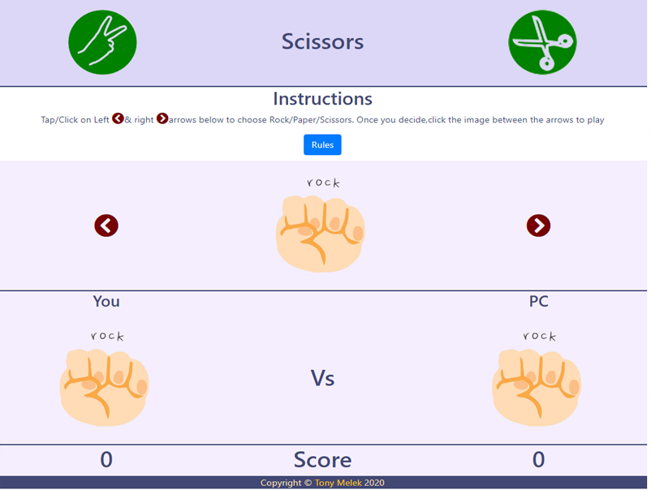

# Rock Paper Scissors Game
## Description
Famous Rock , Paper , Scissors game with responsive design that can be played on desktops and mobile devices as well.
## Features
* The game is open so you can play as much as you like.
*  You can use keyboard arrows and retuen key or mouse to play the game.
*After you select , the computer picks a random choice of the three available options and then the score is updated on the screen along with the computer's choice.

### Rules
* Rock wins to scissors
* Scissors wind to paper
* Paper wins to rock

## Test
You many try the game by simply following the link to [Rock Paper Scissors](https://tonymelek.github.io/rock_paper_scissors/).

## Feedback
You are welecome to provide any feedback or comments on the code to be sent to my e-mail [tonymelek.au@gmail.com](mailto:tonymelek.au@gmail.com)

## License
Rock Paper Scissors Game is &copy; copyight to Tony Melek 2020